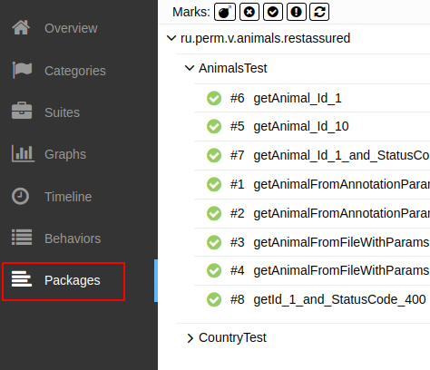
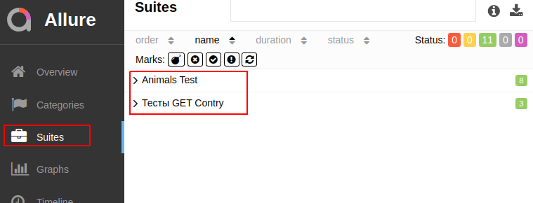

### Behave тестирование RestAssured

Для проведения тестов использован RestAssured<br/>
 [https://github.com/rest-assured/rest-assured](https://github.com/rest-assured/rest-assured/wiki/GettingStarted).

Для просмотра отчетов Allure [https://docs.qameta.io/allure/](https://docs.qameta.io/allure/)

Скрипты выполнять из корневой папки проекта. 
Перед запуском тестов нужно запустить сам проект:
[https://github.com/cherepakhin/camel_boot_rest](https://github.com/cherepakhin/camel_boot_rest)

Проведение теста:

```shell
$  ./mvnw test
```

Просмотр отчета в браузере:

```shell
$ allure serve target/surefire-reports/
```


### Памятка по группировке тестов allure


Пример:

```java
@Tag("animals")
@Epic("REST API Animal")
@DisplayName("Animals Test") 
@Story("Animal requests test")
@Feature("Verify CRUD Operations on Animal")
public class AnimalsTest {
 
}

```

По пакетам:



По строгости (критичности) - аннотация @Severity(SeverityLevel.NORMAL). Работа аннотаций @Epic, @Suite:



Отчет с ошибками:


### Шпаргалка по вложенности


### Закладки

https://docs.qameta.io/allure/
https://allure-framework.github.io/allure-demo/5/#suites/a2891ce60e520f56ae25e6caf68ea773/448aea45096280d4/

