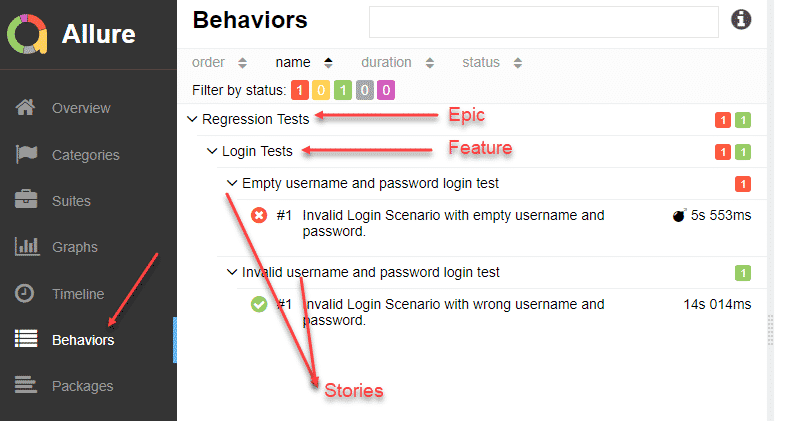

### Behave тестирование RestAssured

Behave тестирование проекта [https://github.com/cherepakhin/camel_boot_rest](https://github.com/cherepakhin/camel_boot_rest).

Для проведения тестов использован RestAssured<br/>
 [https://github.com/rest-assured/rest-assured](https://github.com/rest-assured/rest-assured/wiki/GettingStarted).

Для просмотра отчетов Allure [https://docs.qameta.io/allure/](https://docs.qameta.io/allure/)

Скрипты выполнять из корневой папки проекта. 
Перед запуском тестов нужно запустить сам проект:
[https://github.com/cherepakhin/camel_boot_rest](https://github.com/cherepakhin/camel_boot_rest)

Проведение теста:

```shell
$ ./mvnw clean test
```

Просмотр отчета в браузере:

```shell
$ allure serve target/surefire-reports/
```


### Закладки

[https://docs.qameta.io/allure/](https://docs.qameta.io/allure/)
[https://allure-framework.github.io/allure-demo/5/#suites/a2891ce60e520f56ae25e6caf68ea773/448aea45096280d4/](https://allure-framework.github.io/allure-demo/5/#suites/a2891ce60e520f56ae25e6caf68ea773/448aea45096280d4/)

[Иерархия тестов в Allure Report](https://v.perm.ru/index.php/component/content/article/hierarchy-test?catid=16&Itemid=101)



